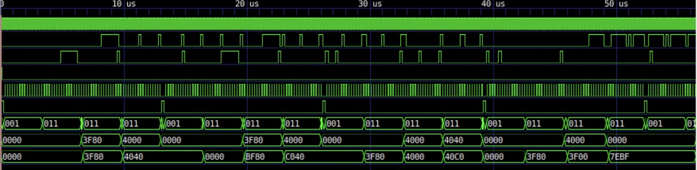
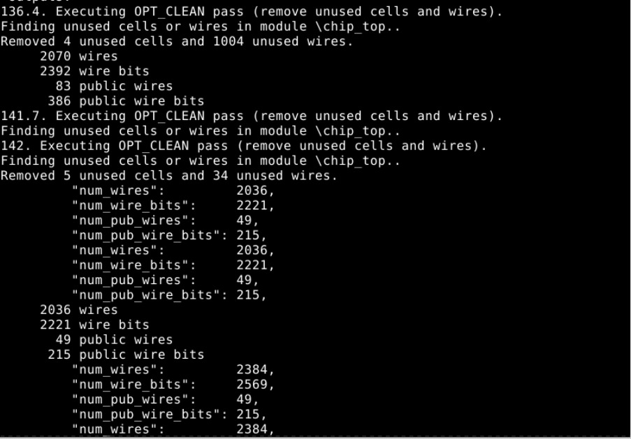
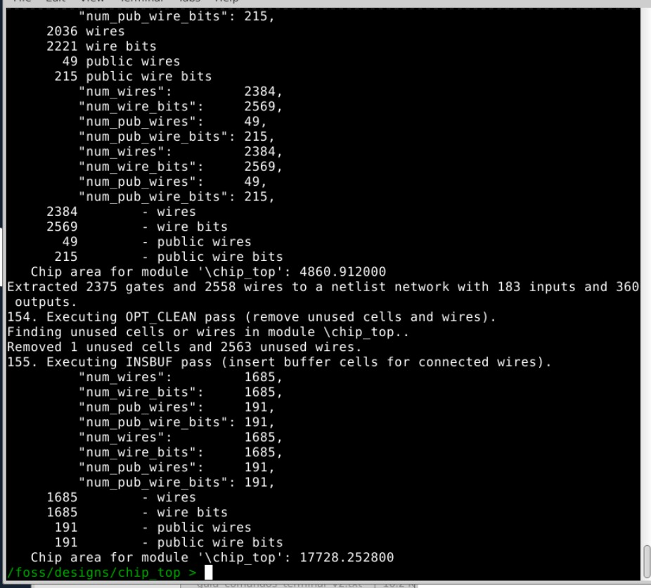
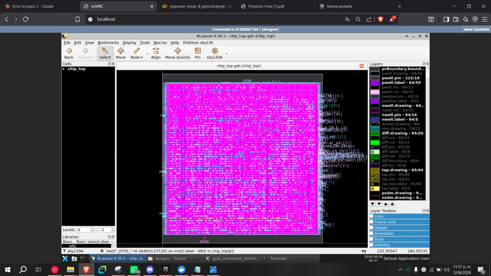

# chip_top — Procesador Aritmético bfloat16 con Interfaz SPI

**Tecnología:** SkyWater sky130A · **Herramienta:** OpenLane 2 · **Reloj:** 50 MHz · **Integrantes:** Daniel Restrepo Ocampo, Juan Pablo Soto Alarcón, Juan Fernando Castaño Sánchez, Hannier Yamith Castillo Molina, Andrés Felipe Tapasco Quintero

---

## 1. Propósito del módulo

`chip_top` es un chip aritmético que implementa operaciones de suma, resta, multiplicación y división acumulada sobre números en formato **bfloat16** (Brain Floating Point de 16 bits: 1 bit de signo, 8 de exponente, 7 de mantisa). El chip expone una **interfaz SPI** (Modo 0, CPOL=0, CPHA=0) de 16 bits por trama, con transmisión LSB primero.

El propósito principal es demostrar la integración de unidades aritméticas de punto flotante en un flujo de diseño digital completo (RTL → síntesis → Place & Route → layout GDS) sobre PDK de código abierto sky130A.

---

## 2. Diagrama de bloques y diagrama de estados

### Diagrama de bloques

```
                         ┌─────────────────────────────────────────────────────┐
         clk ───────────►│                     chip_top                        │
         rst ───────────►│                                                     │
                         │   ┌──────────────┐    ┌────────────────────────┐   │
  sclk ─────────────────►│   │  CDC (2-FF)  │    │  Registro de entrada   │   │
  ss ───────────────────►│   │  sclk_s0/s1  │    │  shift_in  [15:0]      │   │
  mosi ──────────────────►│   │  ss_s0/s1    │    │  bit_count [4:0]       │   │
                         │   │  mosi_s0/s1  │    └──────────┬─────────────┘   │
  miso ◄─────────────────│   └──────┬───────┘               │                 │
                         │          │ sclk_rise/fall         │                 │
                         │          ▼                        ▼                 │
                         │   ┌──────────────────────────────────────────┐     │
                         │   │               FSM Principal               │     │
                         │   │  IDLE → RX_CMD → DECODE → RX_OPERAND     │     │
                         │   │          → EXECUTE → WAIT_DONE           │     │
                         │   └──┬──────────┬──────────┬─────────────────┘     │
                         │      │          │          │                        │
                         │      ▼          ▼          ▼                        │
                         │  ┌────────┐ ┌──────┐ ┌─────────┐                  │
                         │  │fp16_   │ │fpmul │ │frac_div │                  │
                         │  │sum_sub │ │(MPY) │ │  (DIV)  │                  │
                         │  │(SUM/   │ │      │ │  N=8    │                  │
                         │  │ SUB)   │ │      │ │         │                  │
                         │  └───┬────┘ └──┬───┘ └────┬────┘                  │
                         │      └─────────┴──────────┘                        │
                         │                    │                                │
                         │             ┌──────▼──────┐                        │
                         │             │  acc_reg    │ ◄── shift_out → MISO   │
                         │             │  [15:0]     │                        │
                         │             └─────────────┘                        │
                         └─────────────────────────────────────────────────────┘
```

### Diagrama de estados de la FSM

```
                    rst / ss=1
                        │
                        ▼
                   ┌─────────┐
              ┌───►│  IDLE   │◄─────────────────────────────┐
              │    └────┬────┘                               │ opcode inválido
              │         │ ss=0                               │
              │         ▼                                    │
              │    ┌─────────┐  sclk_fall × 16              │
              │    │ RX_CMD  ├──────────────────────────────►│
              │    └────┬────┘                               │
              │         │ bit_count == 15                    │
              │         ▼                                    │
              │    ┌─────────┐                               │
              │    │ DECODE  ├───────────────────────────────┘
              │    └────┬────┘  decodifica opcode + init ACC
              │         │ opcode válido
              │         ▼
  siguiente   │    ┌────────────┐  sclk_fall × 16
  operando    │    │ RX_OPERAND ├──────────────────────────┐
       ◄──────┤    └────────────┘                          │ bit_count == 15
              │                                            ▼
              │    ┌──────────┐                    ┌──────────────┐
              │    │  WAIT    │◄───────────────────│   EXECUTE    │
              │    │  DONE    │  lanza operación   └──────────────┘
              │    └────┬─────┘
              │         │ done → acc_reg ← resultado
              └─────────┘        shift_out ← resultado
```

---

## 3. Cobertura de la especificación

### Implementado y verificado

| Instrucción | Código | Estado |
|---|---|---|
| SUM — sumatoria acumulada | `0000` | Implementado y verificado en simulación |
| SUB — resta acumulada | `1000` | Implementado y verificado en simulación |
| MPY — multiplicación acumulada | `0001` | Implementado y verificado en simulación |
| DIV — división acumulada | `0010` | Implementado y verificado en simulación |
| Inicialización ACC = 0.0 | `init=0000` | Funciona correctamente |
| Inicialización ACC = 1.0 | `init=0001` | Funciona correctamente |
| Interfaz SPI Modo 0, LSB primero | — | Implementada con sincronizadores CDC de doble FF |
| Retorno de ACC en MISO por trama | — | Implementado |

### Pendiente / no implementado

| Instrucción | Código | Observación |
|---|---|---|
| MAC — Multiplicación-Acumulación | `0011` | No implementado. La FSM lo rechaza como opcode inválido |
| MAS — Multiplicación-Sustracción | `1011` | No implementado. Misma situación que MAC |
| Inicialización `001X` sin cambio de ACC | `0010`/`0011` | El valor del acumulador no se preserva correctamente entre sesiones SPI consecutivas |
| Manejo de NaN, Inf, subnormales | — | No se manejan casos especiales bfloat16 |

---

## 4. Vista RTL del diseño

Vista RTL generada con Yosys sobre el módulo `chip_top` completo:


```bash
yosys -p "
  read_verilog src/chip_top.v src/fp16_sum_sub.v src/fpmul.v
               src/rounder.v src/myreg.v src/fractional_divider.v;
  hierarchy -check -top chip_top;
  proc; opt; flatten;
  show -format dot -prefix rtl_view chip_top
"
dot -Tpng rtl_view.dot -o rtl_view.png
```

---

## 5. Simulación comportamental

Simulación realizada con **Icarus Verilog** sobre `tb/tb_chip_top.v`. Vista general de todas las operaciones en secuencia:



En la señal `acc_reg` se observa la secuencia completa de resultados para SUM, SUB, MPY, DIV y el caso excepcional.

### Protocolo SPI utilizado

```
Trama 0:  CMD  (opcode + init ACC)  →  MISO retorna ACC previo al init
Trama 1:  OP1  (operando bfloat16)  →  MISO retorna ACC tras inicialización
Trama N:  OPn  (operando bfloat16)  →  MISO retorna resultado de la op anterior
```

### Caso 1 — SUM: `0 + 1.0 + 2.0 = 3.0`

Se envía el comando `0x0001` (SUM, init ACC=0) seguido de los operandos `0x3F80` (1.0) y `0x4000` (2.0). El acumulador evoluciona de `0x0000` a `0x3F80` (1.0) tras el primer operando, y a `0x4040` (3.0) tras el segundo. El resultado es correcto.

%201%20(3F80)%20+%202%20(4000)%20=%203%20(4040).jpeg)

### Caso 2 — SUB: `0 − 1.0 − 2.0 = −3.0`

Se envía el comando `0x0080` (SUB, init ACC=0) seguido de los operandos `0x3F80` (1.0) y `0x4000` (2.0). El acumulador toma el valor `0xBF80` (−1.0) tras el primer operando y `0xC040` (−3.0) tras el segundo. El signo y la magnitud son correctos en bfloat16.

.jpeg)

### Caso 3 — MPY: `1.0 × 2.0 × 3.0 = 6.0`

Se envía el comando `0x0011` (MPY, init ACC=1.0) seguido de los operandos `0x4000` (2.0) y `0x4040` (3.0). El acumulador toma el valor `0x4000` (2.0) tras el primer operando y `0x40C0` (6.0) tras el segundo. La multiplicación acumulada funciona correctamente.

.jpeg)

### Caso 4 — DIV: `1.0 / 2.0 = 0.5`

Se envía el comando `0x0021` (DIV, init ACC=1.0) seguido del operando `0x4000` (2.0). El acumulador toma el valor `0x3F00` (0.5). El resultado es correcto.

Durante el desarrollo se identificó un bug en el módulo `fractional_divider`: el contador interno estaba declarado con `$clog2(N)-1` bits, lo que para N=8 resultaba en un contador de 3 bits incapaz de representar el valor 8 (necesita 4 bits). Esto impedía que la señal `done` se activara y la FSM quedaba bloqueada en `ST_WAIT_DONE`. La corrección consistió en cambiar la declaración a `reg [$clog2(N):0] counter`.

.jpeg)

### Caso excepcional — Inicialización `001X` (sin cambio de ACC)

Se intentó encadenar una operación DIV seguida de una SUM usando `init=001X` para retener el ACC en 0.5 y sumarle 1.0, esperando obtener 1.5 (`0x3FC0`). El chip produjo `0x7EBF` (aproximadamente 1.27×10³⁸), un valor claramente erróneo.

El análisis indica que al finalizar la sesión SPI con `ss=1` la FSM regresa a `ST_IDLE`, y en la siguiente transacción sobrescribe `shift_out` con el valor de `acc_reg` antes de que este se haya estabilizado correctamente. La retención del acumulador entre sesiones SPI consecutivas no está correctamente implementada. Este caso queda pendiente.


---

## 6. Simulación funcional post-layout y diagrama de temporización

La simulación post-layout se realizó compilando el netlist generado por OpenLane (`final/nl/chip_top.nl.v`) contra las celdas estándar sky130, verificando que la operación SUM produce el resultado correcto `0x4040` = 3.0, confirmando que el flujo de síntesis y P&R es funcionalmente correcto.

### Diagrama de temporización estilo hoja de datos — Operación SUM

```
         t_setup  t_hold
           ◄──►   ◄──►
SS   ‾‾‾‾‾|___________________________|‾‾‾‾‾‾‾‾‾‾‾‾‾‾‾‾‾‾‾‾‾‾‾‾‾‾

SCLK      |‾|_|‾|_ ... _|‾|_|         |‾|_|‾|_ ... _|‾|_|
           └──── Trama CMD (16 bits) ─┘  └── Trama OP1 (16 bits) ─

MOSI      [      CMD: 0x0001 (SUM)    ]  [   OP1: 0x3F80 = 1.0   ]

                                               t_valid
                                                ◄──►
MISO      [    ACC_prev = 0x0000      ]  [   ACC = 0x3F80 = 1.0   ]
                                                  ↑
                                           Resultado disponible
                                           en flanco de bajada SCLK
```

| Parámetro | Valor | Descripción |
|---|---|---|
| `t_setup` MOSI antes de SCLK subida | 80 ns | Tiempo de setup del dato MOSI |
| `t_hold` MOSI después de SCLK subida | 20 ns | Tiempo de hold del dato MOSI |
| `t_valid` SCLK bajada hasta MISO válido | < 1 ciclo SCLK | MISO se actualiza en flanco de bajada |
| Periodo SCLK mínimo | 200 ns | 5 MHz máximo del bus SPI |
| Trama completa (16 bits) | 3.2 µs | A 5 MHz de SCLK |

---

## 7. Análisis, área y temporización del chip

### Análisis del diseño

El chip integra tres unidades aritméticas independientes (`fp16_sum_sub`, `fpmul`, `fractional_divider`) bajo una FSM centralizada que las coordina a través de la interfaz SPI. Cada unidad opera de forma secuencial bajo demanda: la FSM lanza la operación en el estado `ST_EXECUTE` mediante un pulso de un solo ciclo de reloj, y espera la señal `done` en `ST_WAIT_DONE` antes de actualizar el acumulador y retornar al estado de recepción de operandos.

El dominio de reloj del chip (50 MHz) y el dominio SPI (5 MHz) son asíncronos entre sí. Para evitar metaestabilidad, las señales `sclk`, `ss` y `mosi` se sincronizan mediante registros de doble flip-flop (CDC), y los flancos de `sclk` se detectan por comparación de los dos registros sincronizados. Esto introduce una latencia de 2 ciclos de reloj en la detección de flancos SPI, lo cual es despreciable dado que el SCLK es 10 veces más lento que el CLK.

El divisor fraccional implementa el algoritmo de división por restas sucesivas con N=8 iteraciones, operando sobre las mantisas de 8 bits (bit implícito + 7 fraccionarios). El exponente del resultado se calcula como `exp_A - exp_B + 127` y se limita al rango [1, 254] para evitar representar cero o infinito. El signo se obtiene por XOR de los signos de los operandos.

Una limitación identificada es que el diseño no implementa las operaciones MAC y MAS, y no maneja casos especiales del estándar bfloat16 como NaN, infinito o números subnormales. Para una implementación completa del estándar estas condiciones deberían detectarse y propagarse correctamente.

### Métricas de área (síntesis Yosys)





| Metrica | Valor |
|---|---|
| Area total del chip (die area) | 35,424 um2 |
| Area del core | 29,402 um2 |
| Area de instancias estandar | 19,758 um2 |
| Numero de celdas estandar | 2,458 |
| Celdas secuenciales (flip-flops) | 185 |
| Porcentaje de area secuencial | 27.4% |

### Temporización (post-P&R, corner tipico nom_tt_025C_1v80)

| Metrica | Valor | Interpretacion |
|---|---|---|
| Periodo de reloj (CLK) | 20.0 ns | 50 MHz |
| WNS — Worst Negative Slack (setup) | 0.0 ns | Timing cerrado |
| TNS — Total Negative Slack (setup) | 0.0 ns | Sin violaciones |
| WNS — Hold | 0.0 ns | Sin violaciones de hold |
| Frecuencia maxima alcanzada | 50.0 MHz | 1 / (20.0 - 0.0) ns |

El timing cierra sin violaciones en el corner tipico (TT, 25 grados C, 1.8V). En el corner lento (SS, 100 grados C, 1.6V) el WNS es -0.51 ns, lo que indica que a 50 MHz el diseno presenta violaciones marginales en condiciones extremas. Para un diseno orientado a produccion se recomendaria reducir el reloj a 45 MHz o ajustar el CLOCK_PERIOD a 22 ns en el config.json.

---

## 8. Layout final

Layout visualizado en KLayout con el GDS generado por OpenLane (paso `56-magic-streamout`). Se observa la distribucion de 2,458 celdas estandar sky130 con rutas en capas li1, met1 y met2, y los anillos de alimentacion VDD/GND en las capas superiores de metal.



```bash
klayout runs/RUN_*/results/final/chip_top.gds \
    -e -nn $PDK_ROOT/sky130A/libs.tech/klayout/sky130A.lyt
```

---


## Referencias

- [bfloat16-riscv — Modulos aritmeticos fuente](https://github.com/jimarinh/bfloat16-riscv)
- [OpenLane 2 Documentation](https://openlane2.readthedocs.io)
- [SkyWater sky130A PDK](https://skywater-pdk.readthedocs.io)
